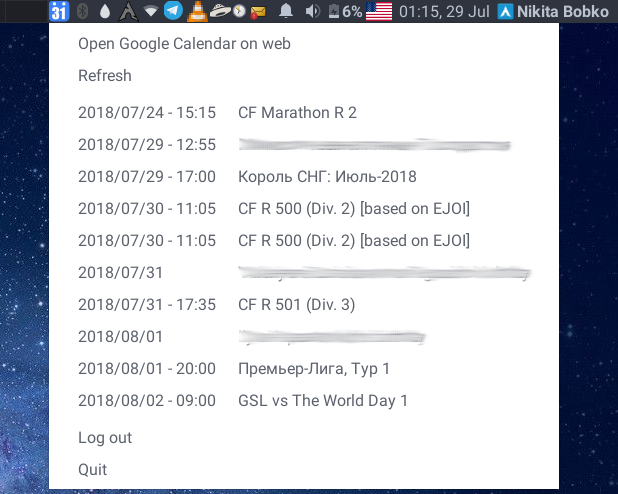
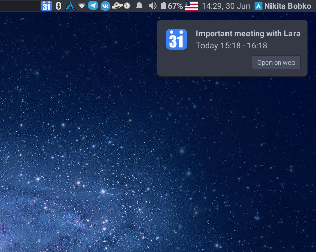

# gcal-notifier-kotlin-gtk 

Simple Google Calendar notifier for Linux written in Kotlin using GTK lib  

# Installation

#### Debian/Ubuntu

* Download *.deb file from [latest release page](https://github.com/nikitabobko/gcal-notifier-kotlin-gtk/releases/latest)
* Double click on downloaded file and press `Install` button **or** via Terminal:  
`sudo apt install ./gcal-notifier-kotlin-gtk-VERSION.deb`

#### Arch Linux

For Arch Linux users [AUR package](https://aur.archlinux.org/packages/gcal-notifier-kotlin-gtk/) is available

#### Other Linux distributions
* Install [all dependencies](#dependencies)
* Download *.tar file from [latest release page](https://github.com/nikitabobko/gcal-notifier-kotlin-gtk/releases/latest)
* Extract tar archive by executing:  
`tar -xvf gcal-notifier-kotlin-gtk-VERSION.tar`
* Install program by executing `install.sh` script in extracted folder:  
`sudo ./install.sh`

# Usage
While app is running it shows small icon in your system tray and popups notifications for events which are set to be reminded in Google Calendar:  

`Hint:` Gnome users may not see that system tray icon as system tray feature was removed in Gnome 3.26. You may want to install
[TopIcons](https://extensions.gnome.org/extension/495/topicons/) or [TopIcons Plus](https://extensions.gnome.org/extension/1031/topicons/)
to return back system tray.

# Dependencies
* JRE 8
* [java-gnome lib](http://java-gnome.sourceforge.net/)

# Uninstallation

For all uninstallation methods it's recommended to log out from gcal-notifier firstly. You can do this by:  
 `Click gcal-notifier icon in system tray` -> `Log out`

#### Debian/Ubuntu

Execute in terminal:  
`sudo apt autoremove gcal-notifier-kotlin-gtk`

#### Arch Linux

Execute in terminal:  
`sudo pacman -Rsn gcal-notifier-kotlin-gtk`

#### Other Linux distributions

* Execute in terminal:  
  `sudo /opt/gcal-notifier-kotlin-gtk/uninstall.sh`
* Don't forget to uninstall [dependencies](#dependencies) if you don't need them anymore

# Building project from sources
For building project [Gradle build tool](https://gradle.org/) is used.  
Before building project ensure that you have [dependencies](#dependencies) installed.

#### Building jar file
Execute `./gradlew jar` to generate jar file in `build/libs/` directory.

#### Run debug gcal-notifier version from sources
`./gradlew runJar`

#### Build tar archive only
`./gradlew tar`

#### Build deb archive only
`./gradlew deb`

#### Running tests
`./gradlew test`
